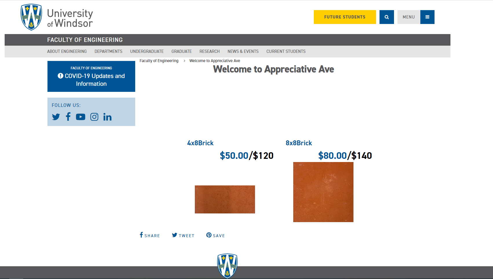

# BrickCanvas Customizer 🧱

## Overview

BrickCanvas Customizer is a web application that allows users to personalize bricks with custom text and designs. Built with HTML, CSS, and JavaScript, this project offers an interactive canvas for real-time design previews, making it easier for customers to visualize their customized bricks before purchasing.

## Features

- **Interactive Canvas**: Real-time design preview on a virtual brick.
- **Text Customization**: Choose from a variety of fonts, sizes, and colors.
- **Design Templates**: Pre-made designs for quick customization.
- **3D Preview**: Visualize your brick from multiple angles (optional).
- **Order Integration**: Seamless ordering process integrated into the application.
- **Responsive Design**: Accessible on desktop, tablet, and mobile devices.

## Technologies

- HTML
- CSS
- JavaScript

## Getting Started

### Prerequisites

- Basic knowledge of HTML, CSS, and JavaScript
- A modern web browser

### Installation

1. Clone the repository
2. Navigate to the project directory
3. Open `index.html` in your web browser

